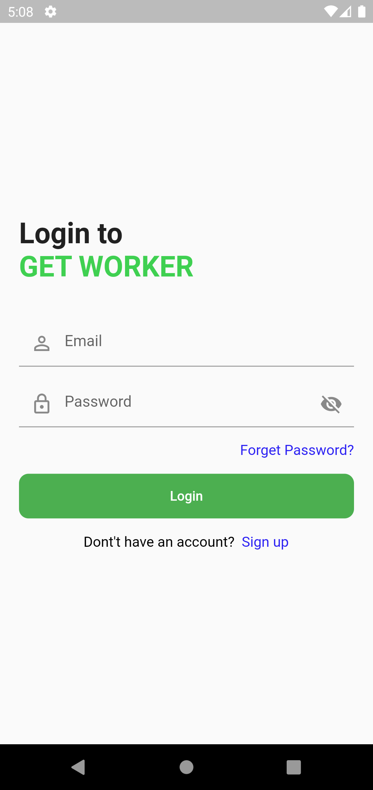
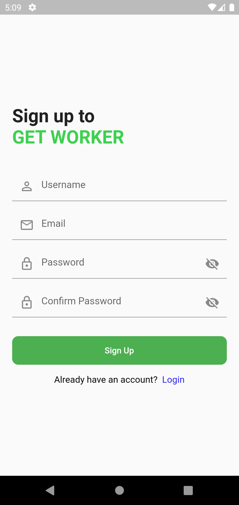

 # GETWORKER(Employer) - ON GOING PROJECT

Getworker is a freelancer application with node js as the
backend, where the employer can search for freelancers and
connect with them.Employer can assign works with the freelancers.
Following MVC architecture.

## Table of contenst

- [Installation](#installation)
- [Usage](#usage)
- [Screenshots](#screenshots)
- [Packages and Credits](#packages-and-credits)
- [License](#license)

## Installation

To install and run this project, you will need to have the following dependencies installed on
your machine:
 - Flutter SDK
 - Android Studio or Visual Studio Code
 - Node js

To install the project, follow these steps:

1. Clone the repository to your local machine
2. Open the project in Android Studio or Visual Studio Code
3. Connect an Android device or lauch an emulator
4. Run the command 'flutter pub get' using the terminal
5. Run the project by clicking the "run" button in the top menu or by using the terminal
   command 'flutter run'
6. Run the command 'npm start' in the command of the backend folder   

## Usage 

Employer can do  the following:

- Can search for freelancers
- Accept and reject proposals
- If the employer accepts the bid user can work as a employee for that project
- Can purchase credits for assigning worker
- Can pay money to freelancers 
- Chat with employee

## Screenshots 

Login Screen                    |   Job Screen             |  Job Detail Screen
:-------------------------:|:-------------------------:|:-------------------------:
|||

## Packages and Credits

- [GetX](https://github.com/jonataslaw/getx)
- [Http](https://github.com/dart-lang/http/tree/master/pkgs/http)
- [Flutter secure storage](https://github.com/mogol/flutter_secure_storage/tree/develop/flutter_secure_storage)
- [Shimmer](https://github.com/hnvn/flutter_shimmer)

## License

- MIT License
- Copyright 2022 © [Vivek V.G](https://github.com/aswinsubhash)

